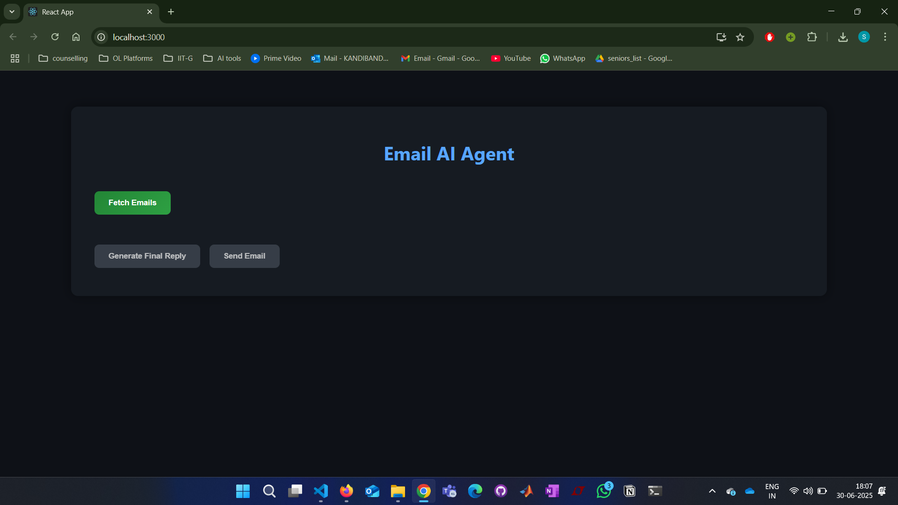

# ✉️ AI Agent for Email Reply 

An intelligent email assistant that reads incoming messages, understands their intent, generates a reply using an LLM, critiques it using a second LLM, and presents it for user approval before sending — all through a user-friendly web interface.

---

## 🚀 Features

- ✅ **Context-Aware Email Understanding**  
  Uses NLP to extract intent, tasks, names, dates, and classify the email type.

- ✍️ **Automated Draft Generation**  
  Generates polite, contextually appropriate replies using a powerful language model.

- 🧠 **Two-Step LLM Critique System**
  One LLM drafts the response, another reviews it for tone, clarity, and accuracy.

- 🧑‍💻 **Human-in-the-Loop Control**  
  Final response is displayed to the user for editing/approval before sending.

- 🌐 **Modern Web UI**  
  Built with **React** (frontend) and **Flask** (backend) for a seamless user experience.

- 🔐 **Secure Gmail API Integration**  
  Fetches emails, sends replies, and manages drafts using OAuth 2.0.

---

## 🧰 Technologies Used

### 🔍 NLP & AI
- **spaCy** – Entity extraction (names, dates, tasks)
- **transformers / HuggingFace** – Zero-shot intent classification & reply generation
- **Gemini APIs** – LLMs for reply generation & critique

### 📡 APIs
- **Gmail API (OAuth 2.0)** – For reading/writing emails

### 💻 Web Stack
- **Frontend**: React, CSS
- **Backend**: Flask (Python)

---

## 🛠️ How It Works

1. **Email Fetching**  
   Connects to Gmail API and fetches unread emails.

2. **Context Extraction**  
   Uses spaCy + transformer-based classifier to identify:
   - Intent: `reply`, `ignore`, or `escalate`
   - Entities: people, dates, times, tasks
   - Email type: `personal`, `professional`, `marketing`, `spam`

3. **Reply Generation**  
   If intent is `reply`, the app generates a response using an LLM like Gemini.

4. **Critique Phase**  
   A second LLM reviews and refines the reply before presenting to the user.

5. **User Approval & Send**  
   User sees the draft in the web UI, can edit it, and hit "Send" to dispatch it via Gmail.

Video Demo
)

---

## 🔐 Authentication

- Uses **OAuth 2.0** to securely connect to the user's Gmail account.
- Tokens are securely stored and refreshed as needed.

---

